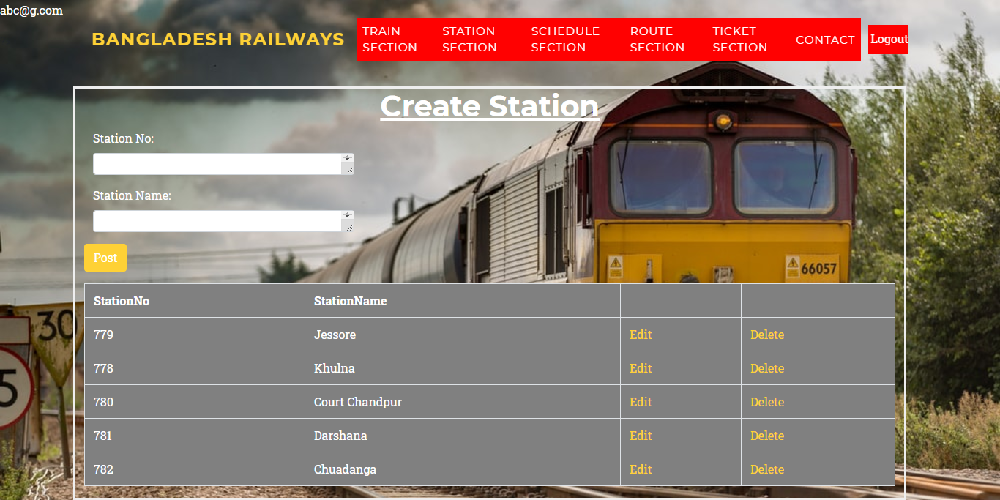

# RailwayMangementSystem
#Shagoto Rahman

Project Title: Railway Management System

Idea Description:
The purpose of this document is to describe the Railway Management System. This document contains the functional, behavioral and non-functional requirements of the project and it also contains the guidelines for system engineers and designers to start working the project. Railway Management System is basically updating the manual Railway system into an application so that the users can know the details of Train, Ticket and schedule time of the train and ticket price.

The project is specifically designed for the use of railway office worker and local public. The product will work as a complete user interface for railway management system and railway usage from ordinary people. Railway Management System can be used by any existing or new railway to manage its time, schedule and ticket selling, insertion and monitoring.

Project Feature:

The information of all people, train and schedule must be stored in a database that is accessible by the website.
MS SQL Server will be used as SQL engine and database.
The railway System is running 24 hours a day.
Home page hold the basic information of this project.
Create station will manage by authority and the worker of railway management. By using station no and station name they can create a new station. They can also update and delete their stations by using this delete and update button.
It will be manage by railway authority. It is the way by which we understand that what is the route and what are the station under this route.
Route details is kind to create a new route to add , delete and update the route authority can easily manage all this. This add and deletion can only manage by authority and admin Norman user cannot see or manage all this think.
To create a train we have to insert train no, train name, route not fill all this information admin can create a new train and that will hold a new route under this train there are many bogies that will hold many information.
In a train there are many bogies. Each bogie has different types of Seat and seat details. Each bogie hold a number that will help to find out the expected bogie easily Passenger will easily move from one bogie to another. This is also a admin interface.
A train is maintain by two thing one is date and the another one is time Admin can create a train time by create time and they also update or delete the previous schedule There using time in and time out .In this thing train come and go and maintain a proper time schedule .This way people can easily know the time and go of the train.
It is also an another part of schedule Time and date are the main part of this schedule.If a train come 11:55pm and left after 5mint then the date will automatically change. This is an automated that change the date.
To create a ticket we have to put train no , route type and data .Here we can go route details to know if we need any information .We can also see the date of train to create a proper ticket.
Search ticket is a user interface People can search ticket and book ticket. To search ticket they have to fill all the information that need in this search option. For booking they have to put name number, from where to where the number of seat they want to book there is also a refresh button that help to refresh the ticket box …
